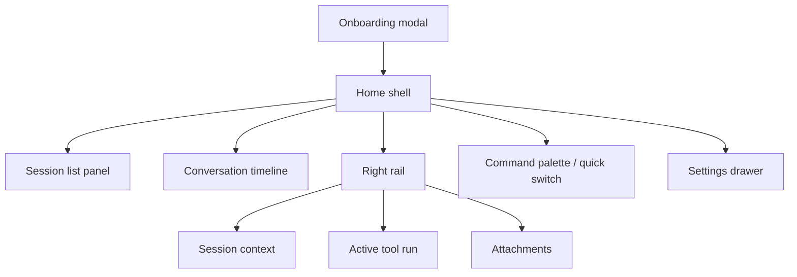

# Issue #1 · Chat Desktop Foundation – UX Overview

## Problem statement
Operators currently rely on CLI sessions, ad‑hoc terminals, or 3rd‑party channels (Slack, Telegram, etc.) to talk to their OpenClaw agents. That makes it hard to:

- View multiple conversations at once and keep context about tool calls, files, and tasks the agent is executing
- Inject their own messages straight into the gateway without pivoting to a chat integration
- Inspect structured artifacts (attachments, tool outputs, node actions) alongside the conversation stream
- Monitor gateway health and per-session status while staying in a “chat-focused” workflow

Issue #1 establishes the UX, terminology, and system flows for a dedicated desktop chat client so subsequent work (Issue #2+) can focus on implementation.

## Goals for the first desktop build
1. **Unified conversation workspace** – surface every session the gateway knows about (direct chats, Slack channels, nodes, cron/task feeds) in one UI, grouped by priority.
2. **Low-latency compose** – let operators send text, slash-style directives, or quick actions without leaving the desktop app.
3. **Rich timeline replay** – mirror what the agent sees: text, code blocks, system notices, tool call streaming, file previews.
4. **Context panels** – make it trivial to inspect session metadata (channel, routing policy, safety gates, tool availability) and task/thread state.
5. **Zero-config local use** – auto-detect the local gateway, but allow remote URLs + tokens for future releases.
6. **Foundational accessibility** – keyboard-first navigation, high-contrast theme, and screen reader-friendly hierarchy from day one.

## Non-goals (for Issue #1)
- Implementing message send/receive plumbing (Issue #2 will cover wiring to the gateway).
- Contact management or channel provisioning.
- Node camera/screen control UI (the wireframes only reserve space for quick actions).
- Deep analytics/dashboards.

## Personas & use cases
| Persona | Motivations | Pain today | Desired outcomes |
| --- | --- | --- | --- |
| **Operator (primary)** | Keep up with human DMs + channel mentions, steer the agent, triage tool alerts. | Juggling Slack/Telegram + terminal windows, missing context about tool calls. | One app that shows every session and lets them reply quickly. |
| **Builder (secondary)** | Debug skills, inspect tool payloads, replay sessions, verify prompts. | log tailing, JSON files, CLI history scattered. | Inspectable timeline with structured blocks + filters. |
| **On-call / reviewer** | Monitor gateway health, acknowledge alerts, ensure agent is alive. | No visual heartbeat unless they watch terminal output. | High-level status pill + last activity per session. |

## Journeys
1. **Re-engage with an active session** – Operator selects a session w/ unread count, reviews last tool call, sends reply.
2. **Follow a tool run** – Builder opens the right-hand “Run” inspector to inspect streaming tool output (files, logs).
3. **Swivel between channels** – On-call toggles between Slack #ops-alerts and Telegram DM without reconfiguring.
4. **Message search & jump** – Operator hits `⌘K`, searches "FigMA handoff", jumps to the exact session + message.

## Screen map

## Surface anatomy & interactions
### 1. Global frame
- **Top bar**: gateway selector (local, remote), connection pill, last heartbeat timestamp, quick actions (pause agent, open logs).
- **Left rail**: stacked sections (Pins, Active, Recent, System). Each session shows channel icon, name, unread badge, last message preview, quick status chips (e.g., `tool`, `blocked`, `pending pairing`).
- **Center timeline**: virtualized list of message blocks. Supports chunked streaming (tool output). Inline metadata chips for node actions, attachments, warnings.
- **Composer**: rich textarea w/ slash menu, attachments, macros, and “send as” identity picker. Shows send status (ready, offline, throttled).
- **Right rail**: collapsible. Tabs for `Context`, `Runs`, `Files`, `Tasks` (Issue #1 defines structure; Issue #2 populates data).

### 2. Key states
| State | UX requirement |
| --- | --- |
| Connecting to gateway | Full-screen overlay with retry + diagnostics CTA. |
| Offline / heartbeat lost | Red pill in top bar, disable send w/ tooltip, queue drafts per session. |
| Tool streaming | Show progress inline (spinner + logs). Right rail auto-focuses matching run. |
| Attachment preview | Inline card with file type icon, open-in-finder button, copy path. |
| Filter/search | Keep focus in search bar; pressing `Enter` jumps to top match, `⌘K` re-opens palette. |

### 3. Keyboard map (initial)
- `⌘K` / `Ctrl+K`: command palette / quick switch
- `⌘F` / `Ctrl+F`: in-session search
- `⌘Enter`: send message
- `⌘Shift+[` and `⌘Shift+]`: navigate session list
- `Esc`: collapse right rail or close dialogs

## UX deliverables for Issue #1
- Interaction contracts for the panels above.
- Placeholder copy + empty states for each panel.
- Visual references for light/dark theme tokens (not implemented yet, but named).

## Success signals
- Operators can describe where key information will live (left, center, right) without ambiguity.
- Engineering has enough flow detail to stub data stores and IPC contracts before wiring real gateway events.

## Open questions to validate later
1. Do we need per-channel custom commands in the composer (e.g., `/slack reply_to`)?
2. Should session list show nested threads for Slack by default, or keep a flat list?
3. What retention is needed for local message cache (rolling window vs. full history)?
4. How should we expose gateway config editing (read-only view vs. in-app editor)?
